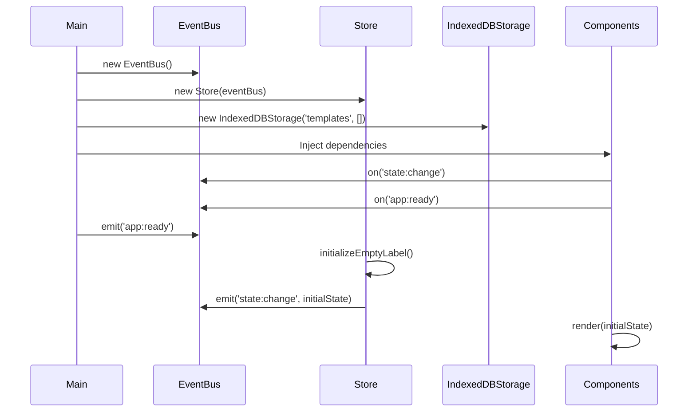
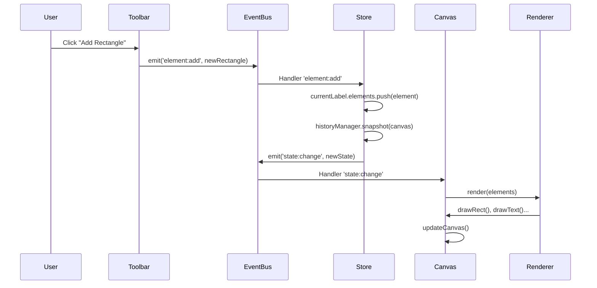
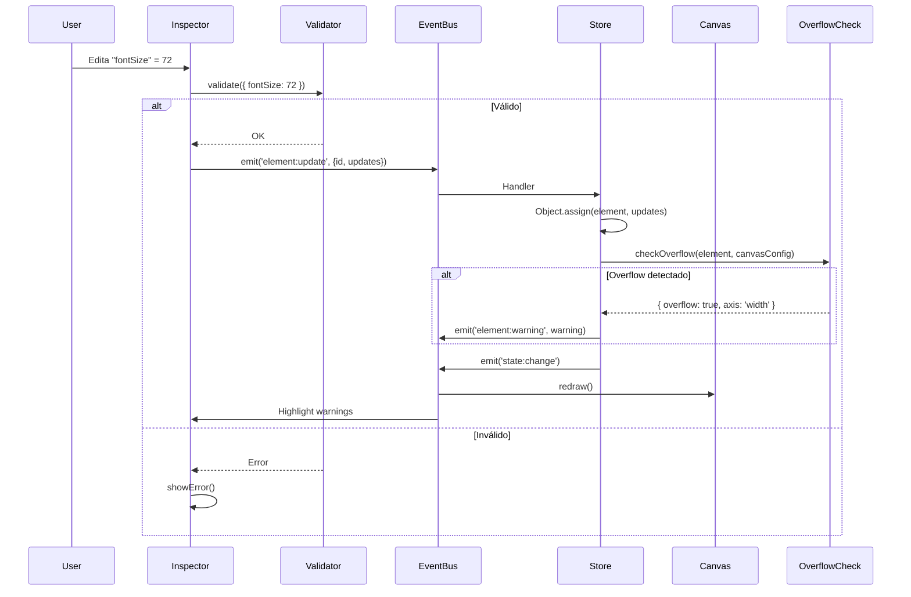
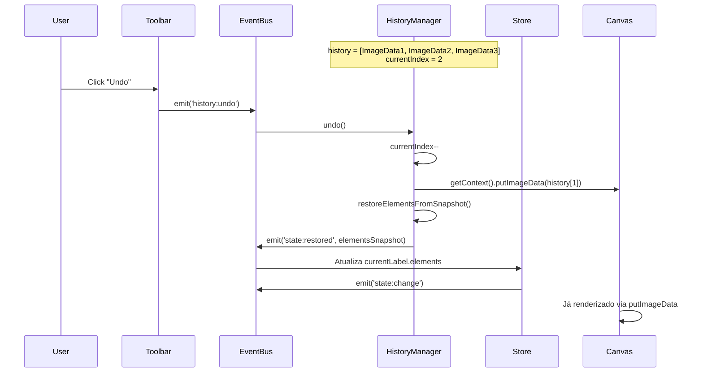
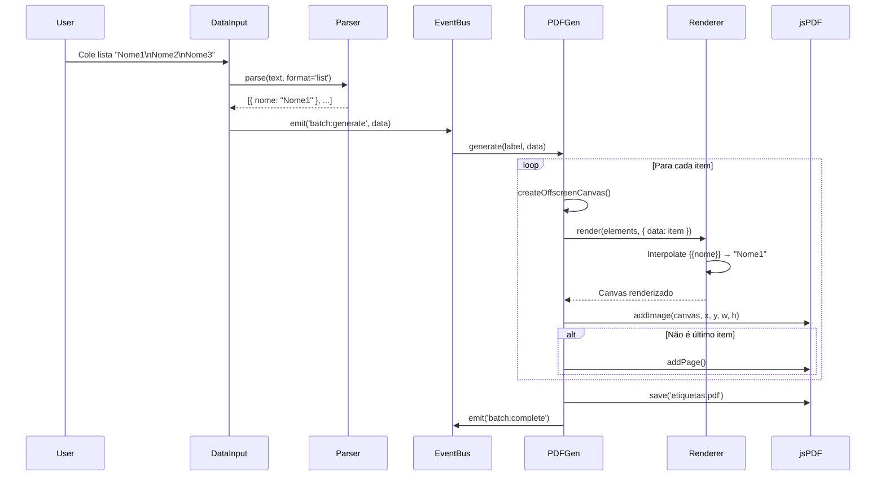
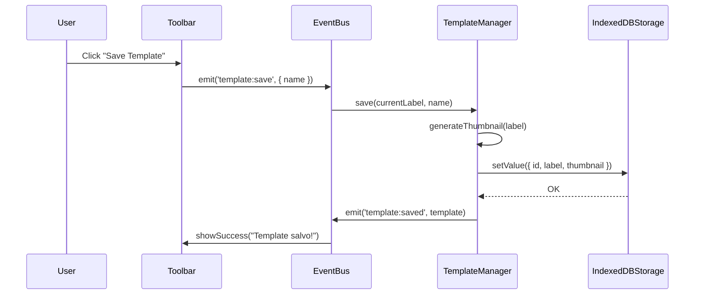

# 🏗️ Arquitetura Detalhada - Gerador de Etiquetas (Event-Driven)

## 📐 Decisões Arquiteturais Consolidadas

### ✅ Refinamentos Aprovados

| Aspecto | Decisão | Impacto Arquitetural |
|---------|---------|---------------------|
| **Undo/Redo** | Array de `ImageData` | Store mantém snapshots binários do canvas, não objetos |
| **Posicionamento** | Via input numérico | Simplifica EditorCanvas (sem drag handlers), foco no Inspector |
| **Export/Import** | Método preparado, UI futura | Interface `ITemplateExporter` desde o início |
| **Templates pré-definidos** | Não no MVP | TemplateManager sem seed inicial |
| **Validação Overflow** | `checkOverflow()` ativo | Validator com feedback visual |
| **Biblioteca externa** | `canvas-txt` para texto | Abstração no TextRenderer |

---

## 🎯 CDNs Sugeridas + Justificativas

### **1. canvas-txt**
```html
<script src="https://unpkg.com/canvas-txt@4.1.1"></script>
```
**Uso:** Renderização de texto com wrap, alinhamento vertical, ellipsis automático  
**Benefício:** Elimina lógica manual de `wrapText()`, `truncateText()`, suporta `textOverflow` out-of-the-box  
**Integração:** Wrapper no `TextRenderer.ts` para manter abstração

---

### **2. jsPDF** (Geração de PDF)
```html
<script src="https://cdnjs.cloudflare.com/ajax/libs/jspdf/2.5.1/jspdf.umd.min.js"></script>
```
**Uso:** Converter canvas para PDF com controle preciso de dimensões em mm  
**Benefício:** API nativa para adicionar múltiplas páginas (etiquetas em lote), preserva qualidade  
**Alternativa:** html2canvas + jsPDF (mais pesado, desnecessário para canvas direto)

---

### **3. uuid** (Geração de IDs)
```html
<script src="https://cdn.jsdelivr.net/npm/uuid@9.0.0/dist/umd/uuidv4.min.js"></script>
```
**Uso:** Gerar IDs únicos para elementos (`element.id`)  
**Benefício:** Evita colisões, padrão industrial  
**Alternativa:** `crypto.randomUUID()` (nativo no browser moderno, preferível se compatibilidade permitir)

---

### **4. PapaParse** (Parse de CSV)
```html
<script src="https://cdn.jsdelivr.net/npm/papaparse@5.4.1/papaparse.min.js"></script>
```
**Uso:** Parsing robusto de CSV para batch data  
**Benefício:** Lida com edge cases (vírgulas em strings, quebras de linha)  
**Fase:** Pós-MVP, quando implementar CSV import

---

### **5. idb-keyval** (IndexedDB Simplificado) - **OPCIONAL**
```html
<script src="https://cdn.jsdelivr.net/npm/idb-keyval@6.2.1/dist/umd.js"></script>
```
**Uso:** Wrapper simples sobre IndexedDB  
**Benefício:** Reduz boilerplate da sua classe `IndexedDBStorage`  
**Decisão:** **NÃO USAR** - você já tem `IndexedDBStorage` implementado, manter consistência

---

## 🗂️ Estrutura de Pastas REFINADA

```
src/
├── core/
│   ├── EventBus.ts                 # ✅ Existente
│   ├── Logger.ts                   # ✅ Existente
│   ├── IndexedDBStorage.ts         # ✅ Existente
│   ├── Store.ts                    # 🆕 State manager + history
│   └── types.ts                    # 🆕 Types compartilhados
│
├── domain/
│   ├── models/
│   │   ├── Label.ts
│   │   ├── CanvasConfig.ts
│   │   └── elements/
│   │       ├── BaseElement.ts      # Interface + factory
│   │       ├── BorderElement.ts
│   │       ├── RectangleElement.ts
│   │       ├── TextElement.ts
│   │       └── ImageElement.ts
│   │
│   ├── services/
│   │   ├── renderers/
│   │   │   ├── CanvasRenderer.ts   # Orquestrador
│   │   │   ├── BorderRenderer.ts   # Renderiza bordas
│   │   │   ├── RectangleRenderer.ts
│   │   │   ├── TextRenderer.ts     # Usa canvas-txt
│   │   │   └── ImageRenderer.ts
│   │   │
│   │   ├── TemplateManager.ts      # CRUD templates
│   │   ├── PDFGenerator.ts         # Batch PDF export
│   │   ├── DataSourceParser.ts     # Parse lista/CSV/JSON
│   │   ├── OverflowValidator.ts    # 🆕 Validação de limites
│   │   └── HistoryManager.ts       # 🆕 Undo/Redo com ImageData
│   │
│   └── validators/
│       └── ElementValidator.ts     # Validações de propriedades
│
├── components/
│   ├── editor/
│   │   ├── EditorCanvas.ts         # Canvas de edição
│   │   ├── ElementInspector.ts     # Formulário de props
│   │   ├── Toolbar.ts              # Add elements, undo/redo
│   │   ├── LayerPanel.ts           # Lista z-index
│   │   └── CanvasConfigPanel.ts    # 🆕 Config de dimensões
│   │
│   ├── preview/
│   │   ├── BatchPreview.ts         # Grid de etiquetas
│   │   ├── PrintSettings.ts        # Config de impressão
│   │   └── DataSourceInput.ts      # 🆕 Input de dados
│   │
│   └── common/
│       └── (seus componentes UI existentes)
│
├── utils/
│   ├── canvas.ts                   # Helpers canvas API
│   ├── units.ts                    # mm ↔ px conversão
│   ├── image.ts                    # toDataURL compression
│   ├── interpolate.ts              # 🆕 {{variable}} replacement
│   └── cdn-loader.ts               # 🆕 Dynamic script loading
│
├── types/
│   └── index.ts                    # Global types
│
├── constants/
│   └── defaults.ts                 # 🆕 Valores padrão
│
└── main.ts
```

---

## 🔄 Fluxo de Dados Detalhado

### **1. Inicialização da Aplicação**



**Responsabilidades:**
- `main.ts`: Bootstrap, DI container, event wiring
- `Store`: Cria label vazio default (210x297mm A4)
- `Components`: Subscribe em eventos relevantes

---

### **2. Adição de Elemento**



**Detalhes Importantes:**

**Toolbar:**
- Botões para cada tipo de elemento
- Ao clicar, cria objeto com valores default
- Emite evento com payload completo

**Store:**
- Valida elemento via `ElementValidator`
- Adiciona ao array `currentLabel.elements`
- Chama `historyManager.snapshot()` **ANTES** de emitir mudança
- Incrementa `element.zIndex` automaticamente

**Canvas:**
- Escuta `state:change`
- Chama `redraw()` que itera sobre `elements` ordenados por `zIndex`
- Cada elemento é passado para renderer específico

---

### **3. Edição de Elemento (via Inspector)**



**Inspector:**
- Form com inputs para cada propriedade
- Validação local (min/max, tipos)
- Debounce de 300ms para evitar flood de eventos
- Exibe warnings visuais (ícone amarelo) se overflow

**OverflowValidator:**
- Verifica se elemento extrapola canvas
- Retorna objeto `{ overflow: boolean, axis?: 'x' | 'y' | 'both', amount?: number }`
- Não bloqueia, apenas alerta

---

### **4. Undo/Redo com ImageData**



**HistoryManager:**

**Estrutura Interna:**
```typescript
interface HistorySnapshot {
  imageData: ImageData;        // Snapshot visual do canvas
  elements: BaseElement[];     // Deep clone dos elementos
  timestamp: number;
}

class HistoryManager {
  private history: HistorySnapshot[] = [];
  private currentIndex: number = -1;
  private maxSize: number = 50; // Limite de memória
}
```

**Método `snapshot()`:**
1. Captura `ctx.getImageData(0, 0, width, height)`
2. Faz deep clone de `currentLabel.elements` (JSON.parse(JSON.stringify))
3. Adiciona ao array `history`
4. Se `history.length > maxSize`, remove mais antigo (FIFO)
5. Incrementa `currentIndex`

**Método `undo()`:**
1. Decrementa `currentIndex`
2. Restaura canvas via `ctx.putImageData(history[currentIndex].imageData)`
3. Retorna `history[currentIndex].elements` para Store atualizar estado

**Método `redo()`:**
- Inverso do undo

**Vantagem:**
- Visual instantâneo (putImageData é O(1))
- Captura exata do rendering (incluindo anti-aliasing)

**Desvantagem:**
- Consome ~4 bytes/pixel (canvas 800x600 = ~2MB por snapshot)
- Limite de 50 snapshots = ~100MB RAM (aceitável)

---

### **5. Geração de PDF em Lote**



**DataSourceParser:**

**Input Formats:**
1. **Lista Simples:**
   ```
   Nome 1
   Nome 2
   ```
   → `[{ text: "Nome 1" }, { text: "Nome 2" }]`

2. **CSV (futuro):**
   ```
   nome,valor
   João,100
   ```
   → `[{ nome: "João", valor: "100" }]`

3. **JSON (futuro):**
   ```json
   [{"nome": "João"}]
   ```

**Método `parse()`:**
- Detecta formato (linha única = lista, vírgula = CSV, `{` = JSON)
- Retorna array de objetos uniformes
- Valida estrutura (mínimo 1 registro)

---

**PDFGenerator:**

**Método `generate(label: Label, data: Record<string, any>[])`:**

1. **Setup:**
   ```typescript
   const pdf = new jsPDF({
     orientation: label.config.widthMM > label.config.heightMM ? 'landscape' : 'portrait',
     unit: 'mm',
     format: [label.config.widthMM, label.config.heightMM]
   });
   ```

2. **Loop de Renderização:**
   ```typescript
   for (let i = 0; i < data.length; i++) {
     const offscreenCanvas = document.createElement('canvas');
     const ctx = offscreenCanvas.getContext('2d');
     
     // Dimensões em pixels (300 DPI)
     offscreenCanvas.width = (label.config.widthMM / 25.4) * 300;
     offscreenCanvas.height = (label.config.heightMM / 25.4) * 300;
     
     // Renderizar com dados interpolados
     this.renderer.renderAll(label.elements, {
       ctx,
       scale: 300 / 25.4,
       data: data[i]
     });
     
     // Adicionar ao PDF
     const imgData = offscreenCanvas.toDataURL('image/png', 0.95);
     pdf.addImage(imgData, 'PNG', 0, 0, label.config.widthMM, label.config.heightMM);
     
     if (i < data.length - 1) {
       pdf.addPage();
     }
   }
   ```

3. **Export:**
   ```typescript
   pdf.save(`etiquetas_${Date.now()}.pdf`);
   ```

**Otimização:**
- Canvas offscreen (não adiciona ao DOM)
- Qualidade 0.95 (balanço tamanho/qualidade)
- Liberação de memória: `offscreenCanvas = null` após cada iteração

---

### **6. Persistência de Templates**



**TemplateManager:**

**Estrutura de Storage:**
```typescript
interface StoredTemplate {
  id: string;                    // UUID
  name: string;
  label: Label;                  // Objeto completo
  thumbnail: string;             // dataURL 200x200px
  createdAt: number;
  updatedAt: number;
}

// IndexedDB key: 'templates'
// Value: StoredTemplate[]
```

**Método `save()`:**
1. Gera thumbnail (renderiza canvas em 200x200px)
2. Cria objeto `StoredTemplate`
3. Persiste via `IndexedDBStorage.setValue('templates', templates)`

**Método `load(id: string)`:**
1. Busca em IndexedDB
2. Reconstrói objetos Element (deserialização)
3. Emite `template:loaded`

**Método `list()`:**
- Retorna array de metadados (id, name, thumbnail)
- Usado para galeria de templates

**Método `exportJSON()` (preparado):**
```typescript
exportJSON(id: string): string {
  const template = this.getById(id);
  return JSON.stringify(template.label, null, 2);
}
```

**Método `importJSON()` (preparado):**
```typescript
importJSON(json: string): void {
  const label = JSON.parse(json);
  // Validação de schema
  this.validateLabelStructure(label);
  // Adiciona aos templates
  this.save(label, 'Imported Template');
}
```

---

## 🎨 Renderização com canvas-txt

### **TextRenderer Detalhado**

**Integração da biblioteca:**

```typescript
// types/canvas-txt.d.ts
declare module 'canvas-txt' {
  interface DrawTextConfig {
    width: number;
    height: number;
    fontSize: number;
    fontFamily: string;
    fontWeight: string;
    fontStyle: string;
    align: 'left' | 'center' | 'right';
    vAlign: 'top' | 'middle' | 'bottom';
    lineHeight: number;
    debug?: boolean;
  }

  export function drawText(
    ctx: CanvasRenderingContext2D,
    text: string,
    x: number,
    y: number,
    config: DrawTextConfig
  ): void;
}
```

**TextRenderer.ts:**

```typescript
import { drawText } from 'canvas-txt';

class TextRenderer {
  render(element: TextElement, context: RenderContext): void {
    const { ctx, scale, data } = context;
    
    // Interpolação
    let text = this.interpolate(element.content, data);
    
    // Conversão de unidades
    const x = element.position.x * scale;
    const y = element.position.y * scale;
    const width = element.dimensions.width * scale;
    const height = element.dimensions.height * scale;
    
    // Configuração canvas-txt
    const config = {
      width,
      height,
      fontSize: element.fontSize * scale,
      fontFamily: element.fontFamily,
      fontWeight: element.fontWeight.toString(),
      fontStyle: element.fontStyle || 'normal',
      align: element.textAlign,
      vAlign: element.verticalAlign,
      lineHeight: element.lineHeight || 1.2
    };
    
    // Aplicar cor
    ctx.fillStyle = element.color;
    
    // Renderizar
    drawText(ctx, text, x, y, config);
  }
  
  private interpolate(text: string, data?: Record<string, any>): string {
    if (!data) return text;
    return text.replace(/\{\{(\w+)\}\}/g, (_, key) => data[key] || '');
  }
}
```

**Vantagens:**
- Elimina código manual de wrap/truncate
- Suporta alinhamento vertical out-of-the-box
- Rendering consistente

---

## 🔍 OverflowValidator (checkOverflow)

**Estratégia de Validação:**

```typescript
interface OverflowResult {
  overflow: boolean;
  details?: {
    axis: 'x' | 'y' | 'both';
    amountX?: number; // mm além do limite
    amountY?: number;
  };
}

class OverflowValidator {
  check(element: BaseElement, config: CanvasConfig): OverflowResult {
    // Elementos sem dimensões (ex: border global)
    if (!('dimensions' in element)) {
      return { overflow: false };
    }
    
    const rightEdge = element.position.x + element.dimensions.width;
    const bottomEdge = element.position.y + element.dimensions.height;
    
    const overflowX = rightEdge > config.widthMM;
    const overflowY = bottomEdge > config.heightMM;
    
    if (!overflowX && !overflowY) {
      return { overflow: false };
    }
    
    return {
      overflow: true,
      details: {
        axis: overflowX && overflowY ? 'both' : overflowX ? 'x' : 'y',
        amountX: overflowX ? rightEdge - config.widthMM : undefined,
        amountY: overflowY ? bottomEdge - config.heightMM : undefined
      }
    };
  }
  
  checkAll(elements: BaseElement[], config: CanvasConfig): Map<string, OverflowResult> {
    const results = new Map();
    elements.forEach(el => {
      const result = this.check(el, config);
      if (result.overflow) {
        results.set(el.id, result);
      }
    });
    return results;
  }
}
```

**Integração no Store:**

```typescript
// Após cada update de elemento
this.eventBus.on('element:update', ({ id, updates }) => {
  const element = this.findElement(id);
  Object.assign(element, updates);
  
  // Validar overflow
  const overflowResult = this.overflowValidator.check(element, this.state.currentLabel.config);
  
  if (overflowResult.overflow) {
    this.eventBus.emit('element:overflow', { id, result: overflowResult });
  } else {
    this.eventBus.emit('element:overflow:clear', { id });
  }
  
  this.emit();
});
```

**Feedback Visual no Inspector:**

```typescript
// ElementInspector.ts
this.eventBus.on('element:overflow', ({ id, result }) => {
  if (id === this.currentElementId) {
    this.showWarning(
      `Elemento ultrapassa ${result.details.axis === 'both' ? 'as bordas' : 'a borda ' + result.details.axis} em ${result.details.amountX || result.details.amountY}mm`
    );
  }
});
```

---

## 🏛️ Padrões de Design Aplicados

### **1. Factory Pattern - Criação de Elementos**

```typescript
// domain/models/elements/ElementFactory.ts

type ElementConfig = Partial<BaseElement> & { type: ElementType };

class ElementFactory {
  private defaults = {
    [ElementType.RECTANGLE]: {
      position: { x: 10, y: 10 },
      dimensions: { width: 50, height: 30 },
      fillColor: '#ffffff',
      strokeColor: '#000000',
      strokeWidth: 1,
      borderRadius: 0,
      zIndex: 0,
      visible: true
    },
    [ElementType.TEXT]: {
      position: { x: 10, y: 10 },
      dimensions: { width: 100, height: 20 },
      content: 'Texto',
      fontFamily: 'Arial',
      fontSize: 12,
      fontWeight: 400,
      color: '#000000',
      textAlign: 'left',
      verticalAlign: 'top',
      overflow: TextOverflow.CLIP,
      zIndex: 0,
      visible: true
    }
    // ...
  };
  
  create(config: ElementConfig): BaseElement {
    const defaults = this.defaults[config.type];
    const element = {
      id: crypto.randomUUID(),
      ...defaults,
      ...config
    };
    
    return element as BaseElement;
  }
}
```

**Uso:**
```typescript
// Toolbar
const newRect = elementFactory.create({
  type: ElementType.RECTANGLE,
  position: { x: 20, y: 30 }
});
```

---

### **2. Strategy Pattern - Renderização**

```typescript
// domain/services/renderers/CanvasRenderer.ts

interface IRenderer {
  render(element: BaseElement, context: RenderContext): void;
}

class CanvasRenderer {
  private renderers: Map<ElementType, IRenderer>;
  
  constructor() {
    this.renderers = new Map([
      [ElementType.BORDER, new BorderRenderer()],
      [ElementType.RECTANGLE, new RectangleRenderer()],
      [ElementType.TEXT, new TextRenderer()],
      [ElementType.IMAGE, new ImageRenderer()]
    ]);
  }
  
  render(element: BaseElement, context: RenderContext): void {
    const renderer = this.renderers.get(element.type);
    if (!renderer) {
      throw new Error(`No renderer for type ${element.type}`);
    }
    renderer.render(element, context);
  }
  
  renderAll(elements: BaseElement[], context: RenderContext): void {
    elements
      .filter(el => el.visible !== false)
      .sort((a, b) => a.zIndex - b.zIndex)
      .forEach(el => this.render(el, context));
  }
}
```

**Benefício:**
- Adicionar novo tipo = nova classe renderer
- Zero modificação em código existente (Open/Closed Principle)

---

### **3. Observer Pattern - EventBus**

Já implementado no seu `EventBus`, mas vou detalhar os eventos:

**Taxonomia de Eventos:**

```typescript
// types/events.ts

interface EventMap {
  // Lifecycle
  'app:ready': void;
  'app:error': Error;
  
  // Elements
  'element:add': BaseElement;
  'element:update': { id: string; updates: Partial<BaseElement> };
  'element:delete': string; // id
  'element:select': string | string[];
  'element:deselect': void;
  'element:overflow': { id: string; result: OverflowResult };
  'element:overflow:clear': { id: string };
  
  // State
  'state:change': AppState;
  'state:restored': { elements: BaseElement[] };
  
  // History
  'history:undo': void;
  'history:redo': void;
  'history:snapshot': void;
  
  // Templates
  'template:save': { name: string };
  'template:load': string; // id
  'template:saved': StoredTemplate;
  'template:loaded': Label;
  'template:deleted': string;
  
  // Batch
  'batch:generate': Record<string, any>[];
  'batch:complete': string; // filename
  'batch:error': Error;
  
  // Canvas Config
  'canvas:resize': { widthMM: number; heightMM: number };
  'canvas:zoom': number; // scale
}
```

**Uso Tipado:**
```typescript
eventBus.on<BaseElement>('element:add', (element) => {
  // element é tipado como BaseElement
});
```

---

### **4. Command Pattern - Undo/Redo (Alternativa)**

**Observação:** Você optou por ImageData, mas para referência futura:

```typescript
interface Command {
  execute(): void;
  undo(): void;
}

class AddElementCommand implements Command {
  constructor(
    private store: Store,
    private element: BaseElement
  ) {}
  
  execute(): void {
    this.store.addElement(this.element);
  }
  
  undo(): void {
    this.store.removeElement(this.element.id);
  }
}

class HistoryManager {
  private commands: Command[] = [];
  private currentIndex = -1;
  
  execute(command: Command): void {
    command.execute();
    this.commands = this.commands.slice(0, this.currentIndex + 1);
    this.commands.push(command);
    this.currentIndex++;
  }
  
  undo(): void {
    if (this.currentIndex >= 0) {
      this.commands[this.currentIndex].undo();
      this.currentIndex--;
    }
  }
}
```

**Comparação:**

| Aspecto | ImageData (Escolhido) | Command Pattern |
|---------|----------------------|----------------|
| Memória | ~2MB/snapshot | ~10KB/comando |
| Velocidade Undo | Instantâneo | Reprocessamento |
| Complexidade | Baixa | Alta |
| Granularidade | Snapshot completo | Ação específica |
| **Melhor para** | MVP, simplicidade | Evolução futura |

---

## 🧪 Estratégia de Validação

### **ElementValidator**

```typescript
interface ValidationRule<T> {
  validate(value: T): boolean;
  message: string;
}

class ElementValidator {
  private rules: Map<string, ValidationRule<any>[]> = new Map([
    ['fontSize', [
      {
        validate: (v) => v > 0 && v <= 500,
        message: 'Tamanho deve estar entre 1 e 500pt'
      }
    ]],
    ['borderRadius', [
      {
        validate: (v) => v >= 0,
        message: 'Raio não pode ser negativo'
      }
    ]],
    ['color', [
      {
        validate: (v) => /^#[0-9A-F]{6}$/i.test(v),
        message: 'Cor deve ser hex válida (#RRGGBB)'
      }
    ]]
  ]);
  
  validate(property: string, value: any): { valid: boolean; errors: string[] } {
    const rules = this.rules.get(property);
    if (!rules) return { valid: true, errors: [] };
    
    const errors = rules
      .filter(rule => !rule.validate(value))
      .map(rule => rule.message);
    
    return {
      valid: errors.length === 0,
      errors
    };
  }
  
  validateElement(element: BaseElement): { valid: boolean; errors: Record<string, string[]> } {
    const allErrors: Record<string, string[]> = {};
    
    for (const [key, value] of Object.entries(element)) {
      const result = this.validate(key, value);
      if (!result.valid) {
        allErrors[key] = result.errors;
      }
    }
    
    return {
      valid: Object.keys(allErrors).length === 0,
      errors: allErrors
    };
  }
}
```

---

## 📦 Utils Essenciais

### **1. units.ts - Conversão de Unidades**

```typescript
export class UnitConverter {
  static MM_TO_INCH = 1 / 25.4;
  
  static mmToPx(mm: number, dpi: number = 300): number {
    return mm * this.MM_TO_INCH * dpi;
  }
  
  static pxToMm(px: number, dpi: number = 300): number {
    return (px / dpi) / this.MM_TO_INCH;
  }
  
  static mmToPt(mm: number): number {
    return mm * 2.83465; // 1mm = 2.83465pt
  }
  
  static ptToMm(pt: number): number {
    return pt / 2.83465;
  }
}
```

---

### **2. image.ts - Compressão de Imagem**

```typescript
export class ImageCompressor {
  static async compress(
    file: File,
    maxWidth: number = 800,
    quality: number = 0.85
  ): Promise<string> {
    return new Promise((resolve, reject) => {
      const img = new Image();
      const reader = new FileReader();
      
      reader.onload = (e) => {
        img.src = e.target?.result as string;
      };
      
      img.onload = () => {
        const canvas = document.createElement('canvas');
        const ctx = canvas.getContext('2d')!;
        
        // Calcular dimensões mantendo aspect ratio
        let { width, height } = img;
        if (width > maxWidth) {
          height = (height / width) * maxWidth;
          width = maxWidth;
        }
        
        canvas.width = width;
        canvas.height = height;
        
        ctx.drawImage(img, 0, 0, width, height);
        
        const dataURL = canvas.toDataURL('image/jpeg', quality);
        resolve(dataURL);
      };
      
      img.onerror = reject;
      reader.readAsDataURL(file);
    });
  }
}
```

---

### **3. interpolate.ts - Substituição de Variáveis**

```typescript
export class StringInterpolator {
  static interpolate(
    template: string,
    data: Record<string, any>
  ): string {
    return template.replace(
      /\{\{(\w+)(?::(\w+))?\}\}/g,
      (match, key, formatter) => {
        const value = data[key];
        
        if (value === undefined) {
          return match; // Mantém placeholder se variável não existe
        }
        
        // Formatadores opcionais (futuro)
        if (formatter) {
          return this.format(value, formatter);
        }
        
        return String(value);
      }
    );
  }
  
  private static format(value: any, formatter: string): string {
    switch (formatter) {
      case 'upper':
        return String(value).toUpperCase();
      case 'lower':
        return String(value).toLowerCase();
      case 'currency':
        return `R$ ${Number(value).toFixed(2)}`;
      default:
        return String(value);
    }
  }
  
  static extractVariables(template: string): string[] {
    const matches = template.matchAll(/\{\{(\w+)(?::(\w+))?\}\}/g);
    return Array.from(matches, m => m[1]);
  }
}
```

**Uso:**
```typescript
// Template: "Olá {{nome}}, seu saldo é {{valor:currency}}"
// Data: { nome: "João", valor: 150.5 }
// Output: "Olá João, seu saldo é R$ 150.50"
```

---

## 🔐 Segurança e Sanitização

### **XSS Prevention (Inputs de Usuário)**

```typescript
class Sanitizer {
  static sanitizeHTML(input: string): string {
    const div = document.createElement('div');
    div.textContent = input;
    return div.innerHTML;
  }
  
  static validateColor(color: string): boolean {
    return /^#[0-9A-F]{6}$/i.test(color);
  }
  
  static sanitizeImageURL(dataURL: string): boolean {
    return dataURL.startsWith('data:image/');
  }
}
```

---

## 🚀 Inicialização da Aplicação (main.ts)

```typescript
// main.ts - Pseudo-implementação

import { EventBus } from './core/EventBus';
import { Logger } from './core/Logger';
import { Store } from './core/Store';
import { IndexedDBStorage } from './core/IndexedDBStorage';

// Services
import { CanvasRenderer } from './domain/services/renderers/CanvasRenderer';
import { TemplateManager } from './domain/services/TemplateManager';
import { PDFGenerator } from './domain/services/PDFGenerator';
import { OverflowValidator } from './domain/services/OverflowValidator';
import { HistoryManager } from './domain/services/HistoryManager';

// Components
import './components/editor/EditorCanvas';
import './components/editor/Toolbar';
import './components/editor/ElementInspector';
// ...

class Application {
  private eventBus: EventBus;
  private logger: Logger;
  private store: Store;
  private storage: IndexedDBStorage<StoredTemplate[]>;
  
  async init() {
    // 1. Core setup
    this.eventBus = new EventBus();
    this.logger = new Logger({ level: LogLevel.DEBUG, prefix: '[App]' });
    
    // 2. Storage
    this.storage = new IndexedDBStorage('templates', []);
    await this.storage.initialize();
    
    // 3. Services
    const renderer = new CanvasRenderer();
    const templateManager = new TemplateManager(this.storage, this.eventBus);
    const pdfGenerator = new PDFGenerator(renderer);
    const overflowValidator = new OverflowValidator();
    const historyManager = new HistoryManager();
    
    // 4. Store
    this.store = new Store(this.eventBus, overflowValidator, historyManager);
    
    // 5. Dependency Injection nos componentes
    const editorCanvas = document.querySelector('editor-canvas');
    editorCanvas.inject({ eventBus: this.eventBus, renderer });
    
    const toolbar = document.querySelector('toolbar-component');
    toolbar.inject({ eventBus: this.eventBus });
    
    // ... outros componentes
    
    // 6. Emit app ready
    this.eventBus.emit('app:ready');
    
    this.logger.info('App', 'Application initialized successfully');
  }
}

// Bootstrap
const app = new Application();
app.init().catch(console.error);
```

---

## 📊 Métricas de Performance

### **Benchmarks Esperados**

| Operação | Tempo Alvo | Métrica |
|----------|-----------|---------|
| Renderização canvas (10 elementos) | < 16ms | 60fps |
| Undo/Redo | < 50ms | Imperceptível |
| Save template (IndexedDB) | < 100ms | Feedback visual |
| Geração PDF (50 etiquetas) | < 5s | Progress bar |
| Load template | < 200ms | Spinner |

### **Otimizações Aplicadas**

1. **Debounce em inputs:**
   - Inspector inputs: 300ms
   - Canvas resize: 150ms

2. **Renderização incremental:**
   - Apenas elementos visíveis (`el.visible !== false`)
   - Ordenação por z-index uma vez

3. **Lazy loading de imagens:**
   - ImageElement armazena `src` como dataURL
   - Objeto `Image` criado on-demand no render

4. **Canvas offscreen para PDF:**
   - Não polui DOM
   - GC automático

---

## ✅ Checklist de Implementação (MVP+)

### **Fase 1: Core**
- [ ] Setup Vite + TypeScript + TailwindCSS
- [ ] Integrar EventBus, Logger, IndexedDBStorage existentes
- [ ] Criar Store com state management
- [ ] Implementar BaseElement + ElementFactory
- [ ] Criar RectangleElement, TextElement, BorderElement
- [ ] Implementar CanvasRenderer + Strategy renderers
- [ ] Integrar canvas-txt no TextRenderer

### **Fase 2: UI Editor**
- [ ] EditorCanvas component
  - [ ] Setup canvas com dimensões configuráveis
  - [ ] Renderização de elementos
  - [ ] Click selection (hitTest)
- [ ] Toolbar component
  - [ ] Botões add element
  - [ ] Undo/Redo buttons
- [ ] ElementInspector component
  - [ ] Form dinâmico baseado em element.type
  - [ ] Validação + feedback visual
- [ ] LayerPanel component
  - [ ] Lista de elementos
  - [ ] Botões de visibilidade/lock

### **Fase 3: Features**
- [ ] HistoryManager com ImageData
- [ ] OverflowValidator + warnings
- [ ] CanvasConfigPanel (dimensões mm, DPI, zoom)
- [ ] TemplateManager
  - [ ] Save/Load
  - [ ] Thumbnail generation
- [ ] ImageElement
  - [ ] Upload via input file
  - [ ] Compressão com ImageCompressor

### **Fase 4: Batch**
- [ ] DataSourceInput component
- [ ] DataSourceParser (lista simples)
- [ ] String interpolation ({{variable}})
- [ ] BatchPreview component
- [ ] PDFGenerator com jsPDF
- [ ] Progress indicator

### **Fase 5: Polish**
- [ ] Testes unitários (services)
- [ ] Error boundaries
- [ ] Loading states
- [ ] Tooltips/Help
- [ ] Deploy GitHub Pages

---

## 🎓 Considerações Finais

### **Pontos Fortes da Arquitetura:**

1. ✅ **Desacoplamento:** EventBus elimina dependências diretas entre componentes
2. ✅ **Extensibilidade:** Novos elementos = nova classe, zero refactoring
3. ✅ **Testabilidade:** Services isolados, mocks fáceis
4. ✅ **Performance:** Renderização otimizada, debounce, offscreen canvas
5. ✅ **Manutenibilidade:** Separação clara de responsabilidades

### **Riscos Identificados:**

1. ⚠️ **Memória (Undo/Redo):** 50 snapshots * 2MB = 100MB RAM
   - **Mitigação:** Limite configurável, GC automático de snapshots antigos

2. ⚠️ **IndexedDB Quota:** Navegadores limitam ~50MB por origem
   - **Mitigação:** Warning ao atingir 80%, cleanup de templates antigos

3. ⚠️ **Canvas Performance:** Muitos elementos (100+) pode degradar
   - **Mitigação:** Virtualização futura, limite soft de 50 elementos

4. ⚠️ **PDF Geração (Lote Grande):** 1000 etiquetas = ~30s
   - **Mitigação:** Worker thread (futuro), progress indicator

### **Evolução Pós-MVP:**

1. **Drag & Drop:** Implementar `InteractionManager` para arrastar elementos
2. **Snap to Grid:** Sistema de guias magnéticas
3. **Templates Pré-definidos:** Gallery com exemplos (produtos, eventos, etc)
4. **Export/Import JSON:** UI para backup de templates
5. **CSV/JSON Import:** Integração com PapaParse
6. **Undo com Command Pattern:** Migração para granularidade fina
7. **Multiplayer (Colaboração):** WebRTC para edição simultânea (ambicioso!)
