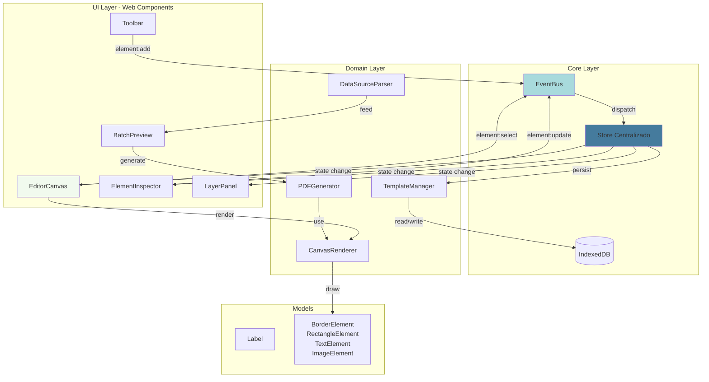

# 🏗️ Arquitetura - Gerador de Etiquetas (MVP)

Excelente projeto! Um gerador de etiquetas com edição visual é um caso perfeito para aplicar arquitetura modular e escalável. Vamos estruturar isso de forma que o MVP seja sólido e a evolução seja natural.

---

## 📋 Análise do Contexto

**Domínio:** Editor gráfico para design de etiquetas + geração em lote
**Complexidade:** Média-Alta (canvas manipulation, state management, PDF generation)
**Stack:** Web Components + TypeScript + Vite + TailwindCSS
**Constraint:** Client-side only, sem backend

---

## 🎯 Proposta Arquitetural (3 Variações Avaliadas)

Avaliei internamente 3 abordagens:

| Critério | **Variação 1: MVC Clássico** | **Variação 2: Event-Driven** | **Variação 3: Component-Based State** |
|----------|------------------------------|------------------------------|---------------------------------------|
| **Separação de responsabilidades** | ⭐⭐⭐ | ⭐⭐⭐⭐⭐ | ⭐⭐⭐⭐ |
| **Facilidade de testes** | ⭐⭐⭐⭐ | ⭐⭐⭐⭐⭐ | ⭐⭐⭐ |
| **Escalabilidade futura** | ⭐⭐⭐ | ⭐⭐⭐⭐⭐ | ⭐⭐⭐⭐ |
| **Complexidade inicial** | Baixa | Média | Baixa |
| **Adequação ao Web Components** | ⭐⭐⭐ | ⭐⭐⭐⭐⭐ | ⭐⭐⭐⭐⭐ |

**✅ Recomendação: Variação 2 - Event-Driven Architecture com Store Centralizado**

Justificativa: 
- Seu `EventBus` já está pronto e é perfeito para comunicação desacoplada
- Canvas manipulation se beneficia de event-driven (drag, drop, resize)
- Facilita undo/redo futuro
- Permite evolução gradual sem refatoração massiva

---

## 🗂️ Estrutura de Pastas Proposta

```
src/
├── core/
│   ├── EventBus.ts                 # ✅ Já existe
│   ├── Logger.ts                   # ✅ Já existe
│   ├── IndexedDBStorage.ts         # ✅ Já existe
│   └── Store.ts                    # 🆕 State management central
│
├── domain/
│   ├── models/
│   │   ├── Label.ts                # Modelo da etiqueta
│   │   ├── elements/
│   │   │   ├── BaseElement.ts      # Interface base
│   │   │   ├── BorderElement.ts
│   │   │   ├── RectangleElement.ts
│   │   │   ├── TextElement.ts
│   │   │   └── ImageElement.ts
│   │   └── CanvasConfig.ts         # Configuração do canvas
│   │
│   ├── services/
│   │   ├── CanvasRenderer.ts       # Renderização no canvas
│   │   ├── PDFGenerator.ts         # Geração de PDF
│   │   ├── TemplateManager.ts      # CRUD de templates (IndexedDB)
│   │   └── DataSourceParser.ts     # Parse CSV/JSON/lista
│   │
│   └── validators/
│       └── ElementValidator.ts     # Validação de propriedades
│
├── components/
│   ├── editor/
│   │   ├── EditorCanvas.ts         # Web Component - Canvas principal
│   │   ├── ElementInspector.ts     # Web Component - Formulário de edição
│   │   ├── Toolbar.ts              # Web Component - Barra de ferramentas
│   │   └── LayerPanel.ts           # Web Component - Lista de elementos
│   │
│   ├── preview/
│   │   ├── BatchPreview.ts         # Web Component - Preview em lote
│   │   └── PrintSettings.ts        # Web Component - Config de impressão
│   │
│   └── common/
│       ├── Button.ts               # ✅ Se já existe, usar
│       ├── Input.ts
│       └── ColorPicker.ts
│
├── utils/
│   ├── canvas.ts                   # Helpers para canvas API
│   ├── units.ts                    # Conversão mm ↔ px
│   └── image.ts                    # toDataURL com compressão
│
├── types/
│   └── index.ts                    # Types globais
│
└── main.ts                         # Entry point
```

---

## 🧩 Arquitetura Visual (Mermaid)



---

## 💾 Modelagem de Dados (TypeScript)

### 1️⃣ BaseElement (Interface Abstrata)

```typescript
// src/domain/models/elements/BaseElement.ts

export enum ElementType {
  BORDER = 'border',
  RECTANGLE = 'rectangle',
  TEXT = 'text',
  IMAGE = 'image'
}

export interface Position {
  x: number; // em mm
  y: number; // em mm
}

export interface Dimensions {
  width: number;  // em mm
  height: number; // em mm
}

export interface BaseElement {
  id: string;
  type: ElementType;
  position: Position;
  zIndex: number;
  locked?: boolean;
  visible?: boolean;
}

export interface RenderContext {
  ctx: CanvasRenderingContext2D;
  scale: number; // mm -> px
  data?: Record<string, any>; // Para interpolação de variáveis
}
```

### 2️⃣ Elementos Específicos

```typescript
// src/domain/models/elements/BorderElement.ts

export enum BorderStyle {
  SOLID = 'solid',
  DASHED = 'dashed',
  DOTTED = 'dotted',
  DOUBLE = 'double'
}

export interface BorderElement extends BaseElement {
  type: ElementType.BORDER;
  style: BorderStyle;
  width: number; // espessura em mm
  color: string; // hex
  radius?: number; // raio para cantos arredondados
}
```

```typescript
// src/domain/models/elements/RectangleElement.ts

export interface RectangleElement extends BaseElement {
  type: ElementType.RECTANGLE;
  dimensions: Dimensions;
  fillColor?: string;
  strokeColor?: string;
  strokeWidth?: number; // em mm
  borderRadius?: number; // em mm
}
```

```typescript
// src/domain/models/elements/TextElement.ts

export enum TextOverflow {
  CLIP = 'clip',
  ELLIPSIS = 'ellipsis',
  WRAP = 'wrap',
  SCALE = 'scale' // auto-resize font
}

export interface TextElement extends BaseElement {
  type: ElementType.TEXT;
  dimensions: Dimensions;
  content: string; // Pode conter {{variable}}
  fontFamily: string;
  fontSize: number; // em pt
  fontWeight: number | string; // 400, 'bold', etc
  fontStyle?: 'normal' | 'italic';
  color: string;
  textAlign: 'left' | 'center' | 'right';
  verticalAlign: 'top' | 'middle' | 'bottom';
  overflow: TextOverflow;
  lineHeight?: number; // multiplicador
  dataSource?: 'static' | 'variable'; // static ou nome da variável
}
```

```typescript
// src/domain/models/elements/ImageElement.ts

export interface ImageElement extends BaseElement {
  type: ElementType.IMAGE;
  dimensions: Dimensions;
  src: string; // dataURL
  fit: 'cover' | 'contain' | 'fill' | 'none';
  opacity?: number; // 0-1
  // Parâmetros do canvas
  smoothing?: boolean;
  compositeOperation?: GlobalCompositeOperation;
}
```

### 3️⃣ Label (Documento Principal)

```typescript
// src/domain/models/Label.ts

export interface CanvasConfig {
  widthMM: number;
  heightMM: number;
  dpi: number; // padrão 300 para impressão
  previewScale: number; // 0.5, 1, 2 (zoom do preview)
}

export interface Label {
  id: string;
  name: string;
  config: CanvasConfig;
  elements: (BorderElement | RectangleElement | TextElement | ImageElement)[];
  createdAt: Date;
  updatedAt: Date;
}

export interface Template {
  id: string;
  label: Label;
  thumbnail?: string; // dataURL preview
}
```

---

## 🔄 Store Centralizado (State Management)

```typescript
// src/core/Store.ts

import { EventBus } from './EventBus';
import { Label } from '../domain/models/Label';
import { BaseElement } from '../domain/models/elements/BaseElement';

export interface AppState {
  currentLabel: Label | null;
  selectedElementIds: string[];
  clipboard: BaseElement[];
  history: Label[]; // Para undo/redo
  historyIndex: number;
}

export class Store {
  private state: AppState;
  private eventBus: EventBus;

  constructor(eventBus: EventBus) {
    this.eventBus = eventBus;
    this.state = {
      currentLabel: null,
      selectedElementIds: [],
      clipboard: [],
      history: [],
      historyIndex: -1
    };

    this.registerEvents();
  }

  private registerEvents(): void {
    this.eventBus.on('element:add', (element: BaseElement) => {
      if (!this.state.currentLabel) return;
      this.state.currentLabel.elements.push(element);
      this.pushHistory();
      this.emit();
    });

    this.eventBus.on('element:update', ({ id, updates }: { id: string; updates: Partial<BaseElement> }) => {
      if (!this.state.currentLabel) return;
      const element = this.state.currentLabel.elements.find(el => el.id === id);
      if (element) {
        Object.assign(element, updates);
        this.pushHistory();
        this.emit();
      }
    });

    this.eventBus.on('element:delete', (id: string) => {
      if (!this.state.currentLabel) return;
      this.state.currentLabel.elements = this.state.currentLabel.elements.filter(el => el.id !== id);
      this.state.selectedElementIds = this.state.selectedElementIds.filter(elId => elId !== id);
      this.pushHistory();
      this.emit();
    });

    this.eventBus.on('element:select', (id: string | string[]) => {
      this.state.selectedElementIds = Array.isArray(id) ? id : [id];
      this.emit();
    });
  }

  private pushHistory(): void {
    if (!this.state.currentLabel) return;
    const snapshot = JSON.parse(JSON.stringify(this.state.currentLabel));
    this.state.history = this.state.history.slice(0, this.state.historyIndex + 1);
    this.state.history.push(snapshot);
    this.state.historyIndex++;
  }

  private emit(): void {
    this.eventBus.emit('state:change', this.getState());
  }

  getState(): Readonly<AppState> {
    return Object.freeze({ ...this.state });
  }

  loadLabel(label: Label): void {
    this.state.currentLabel = label;
    this.state.history = [JSON.parse(JSON.stringify(label))];
    this.state.historyIndex = 0;
    this.emit();
  }

  undo(): void {
    if (this.state.historyIndex > 0) {
      this.state.historyIndex--;
      this.state.currentLabel = JSON.parse(JSON.stringify(this.state.history[this.state.historyIndex]));
      this.emit();
    }
  }

  redo(): void {
    if (this.state.historyIndex < this.state.history.length - 1) {
      this.state.historyIndex++;
      this.state.currentLabel = JSON.parse(JSON.stringify(this.state.history[this.state.historyIndex]));
      this.emit();
    }
  }
}
```

---

## 🎨 Exemplo de Web Component (EditorCanvas)

```typescript
// src/components/editor/EditorCanvas.ts

import { BaseElement } from '../../domain/models/elements/BaseElement';
import { CanvasRenderer } from '../../domain/services/CanvasRenderer';
import { EventBus } from '../../core/EventBus';
import { AppState } from '../../core/Store';

export class EditorCanvas extends HTMLElement {
  private canvas!: HTMLCanvasElement;
  private ctx!: CanvasRenderingContext2D;
  private renderer!: CanvasRenderer;
  private eventBus: EventBus;
  private currentState: AppState | null = null;

  constructor(eventBus: EventBus, renderer: CanvasRenderer) {
    super();
    this.eventBus = eventBus;
    this.renderer = renderer;
    this.attachShadow({ mode: 'open' });
  }

  connectedCallback(): void {
    this.render();
    this.setupCanvas();
    this.attachListeners();
  }

  private render(): void {
    if (!this.shadowRoot) return;
    this.shadowRoot.innerHTML = `
      <style>
        :host {
          display: block;
          width: 100%;
          height: 100%;
        }
        canvas {
          border: 1px solid #e5e7eb;
          background: white;
          cursor: crosshair;
        }
      </style>
      <canvas></canvas>
    `;
  }

  private setupCanvas(): void {
    this.canvas = this.shadowRoot!.querySelector('canvas')!;
    this.ctx = this.canvas.getContext('2d')!;
  }

  private attachListeners(): void {
    this.eventBus.on<AppState>('state:change', (state) => {
      this.currentState = state;
      this.redraw();
    });

    this.canvas.addEventListener('click', (e) => this.handleClick(e));
    this.canvas.addEventListener('mousemove', (e) => this.handleHover(e));
  }

  private redraw(): void {
    if (!this.currentState?.currentLabel) return;

    const { config, elements } = this.currentState.currentLabel;
    
    // Ajustar tamanho do canvas
    const scale = config.previewScale;
    const widthPx = (config.widthMM / 25.4) * config.dpi * scale;
    const heightPx = (config.heightMM / 25.4) * config.dpi * scale;
    
    this.canvas.width = widthPx;
    this.canvas.height = heightPx;

    // Limpar canvas
    this.ctx.clearRect(0, 0, widthPx, heightPx);

    // Renderizar elementos
    elements
      .filter(el => el.visible !== false)
      .sort((a, b) => a.zIndex - b.zIndex)
      .forEach(element => {
        this.renderer.render(element, {
          ctx: this.ctx,
          scale: (config.dpi / 25.4) * scale
        });
      });

    // Destacar selecionados
    this.highlightSelected();
  }

  private highlightSelected(): void {
    if (!this.currentState) return;
    const selectedIds = this.currentState.selectedElementIds;
    // Desenhar outline nos elementos selecionados
    // ... implementação
  }

  private handleClick(e: MouseEvent): void {
    // Hit detection e emissão de evento element:select
    const rect = this.canvas.getBoundingClientRect();
    const x = e.clientX - rect.left;
    const y = e.clientY - rect.top;
    
    // Encontrar elemento clicado (reverse order, top-most first)
    const clickedElement = this.findElementAt(x, y);
    
    if (clickedElement) {
      this.eventBus.emit('element:select', clickedElement.id);
    }
  }

  private findElementAt(x: number, y: number): BaseElement | null {
    if (!this.currentState?.currentLabel) return null;
    
    const elements = [...this.currentState.currentLabel.elements]
      .filter(el => el.visible !== false)
      .sort((a, b) => b.zIndex - a.zIndex); // Top-most first

    for (const element of elements) {
      if (this.renderer.hitTest(element, x, y, this.currentState.currentLabel.config)) {
        return element;
      }
    }
    
    return null;
  }

  private handleHover(e: MouseEvent): void {
    // Mudar cursor baseado no elemento sob o mouse
  }
}

customElements.define('editor-canvas', EditorCanvas);
```

---

## 🔧 CanvasRenderer (Service)

```typescript
// src/domain/services/CanvasRenderer.ts

import { BaseElement, ElementType, RenderContext } from '../models/elements/BaseElement';
import { BorderElement, BorderStyle } from '../models/elements/BorderElement';
import { RectangleElement } from '../models/elements/RectangleElement';
import { TextElement, TextOverflow } from '../models/elements/TextElement';
import { ImageElement } from '../models/elements/ImageElement';

export class CanvasRenderer {
  render(element: BaseElement, context: RenderContext): void {
    switch (element.type) {
      case ElementType.BORDER:
        this.renderBorder(element as BorderElement, context);
        break;
      case ElementType.RECTANGLE:
        this.renderRectangle(element as RectangleElement, context);
        break;
      case ElementType.TEXT:
        this.renderText(element as TextElement, context);
        break;
      case ElementType.IMAGE:
        this.renderImage(element as ImageElement, context);
        break;
    }
  }

  private renderBorder(element: BorderElement, { ctx, scale }: RenderContext): void {
    const x = element.position.x * scale;
    const y = element.position.y * scale;
    const width = element.width * scale;

    ctx.save();
    ctx.strokeStyle = element.color;
    ctx.lineWidth = width;

    switch (element.style) {
      case BorderStyle.SOLID:
        ctx.setLineDash([]);
        break;
      case BorderStyle.DASHED:
        ctx.setLineDash([width * 3, width * 2]);
        break;
      case BorderStyle.DOTTED:
        ctx.setLineDash([width, width]);
        break;
      case BorderStyle.DOUBLE:
        // Desenhar duas linhas
        break;
    }

    // Desenhar retângulo (assumindo borda ao redor do canvas)
    ctx.strokeRect(x, y, ctx.canvas.width - 2 * x, ctx.canvas.height - 2 * y);
    
    ctx.restore();
  }

  private renderRectangle(element: RectangleElement, { ctx, scale }: RenderContext): void {
    const x = element.position.x * scale;
    const y = element.position.y * scale;
    const width = element.dimensions.width * scale;
    const height = element.dimensions.height * scale;
    const radius = (element.borderRadius || 0) * scale;

    ctx.save();

    if (radius > 0) {
      this.roundRect(ctx, x, y, width, height, radius);
    } else {
      ctx.rect(x, y, width, height);
    }

    if (element.fillColor) {
      ctx.fillStyle = element.fillColor;
      ctx.fill();
    }

    if (element.strokeColor && element.strokeWidth) {
      ctx.strokeStyle = element.strokeColor;
      ctx.lineWidth = element.strokeWidth * scale;
      ctx.stroke();
    }

    ctx.restore();
  }

  private renderText(element: TextElement, { ctx, scale, data }: RenderContext): void {
    const x = element.position.x * scale;
    const y = element.position.y * scale;
    const width = element.dimensions.width * scale;
    const height = element.dimensions.height * scale;

    // Interpolação de variáveis
    let text = element.content;
    if (data && element.dataSource !== 'static') {
      text = text.replace(/\{\{(\w+)\}\}/g, (_, key) => data[key] || '');
    }

    ctx.save();
    ctx.fillStyle = element.color;
    ctx.font = `${element.fontStyle || 'normal'} ${element.fontWeight} ${element.fontSize * scale}px ${element.fontFamily}`;
    ctx.textBaseline = 'top';

    // Tratamento de overflow
    switch (element.overflow) {
      case TextOverflow.CLIP:
        ctx.fillText(text, x, y, width);
        break;
      case TextOverflow.ELLIPSIS:
        text = this.truncateText(ctx, text, width);
        ctx.fillText(text, x, y);
        break;
      case TextOverflow.WRAP:
        this.wrapText(ctx, text, x, y, width, element.lineHeight || 1.2);
        break;
      case TextOverflow.SCALE:
        // Auto-ajustar fontSize
        break;
    }

    ctx.restore();
  }

  private renderImage(element: ImageElement, { ctx, scale }: RenderContext): void {
    const x = element.position.x * scale;
    const y = element.position.y * scale;
    const width = element.dimensions.width * scale;
    const height = element.dimensions.height * scale;

    const img = new Image();
    img.src = element.src;

    ctx.save();
    
    if (element.opacity !== undefined) {
      ctx.globalAlpha = element.opacity;
    }

    if (element.compositeOperation) {
      ctx.globalCompositeOperation = element.compositeOperation;
    }

    ctx.imageSmoothingEnabled = element.smoothing !== false;

    // Aplicar fit
    switch (element.fit) {
      case 'cover':
        // ... cálculo de crop
        ctx.drawImage(img, x, y, width, height);
        break;
      case 'contain':
        // ... cálculo de letterbox
        break;
      case 'fill':
        ctx.drawImage(img, x, y, width, height);
        break;
    }

    ctx.restore();
  }

  hitTest(element: BaseElement, x: number, y: number, config: any): boolean {
    const scale = (config.dpi / 25.4) * config.previewScale;
    const elX = element.position.x * scale;
    const elY = element.position.y * scale;

    if ('dimensions' in element) {
      const elWidth = element.dimensions.width * scale;
      const elHeight = element.dimensions.height * scale;
      return x >= elX && x <= elX + elWidth && y >= elY && y <= elY + elHeight;
    }

    return false;
  }

  private roundRect(ctx: CanvasRenderingContext2D, x: number, y: number, width: number, height: number, radius: number): void {
    ctx.beginPath();
    ctx.moveTo(x + radius, y);
    ctx.lineTo(x + width - radius, y);
    ctx.quadraticCurveTo(x + width, y, x + width, y + radius);
    ctx.lineTo(x + width, y + height - radius);
    ctx.quadraticCurveTo(x + width, y + height, x + width - radius, y + height);
    ctx.lineTo(x + radius, y + height);
    ctx.quadraticCurveTo(x, y + height, x, y + height - radius);
    ctx.lineTo(x, y + radius);
    ctx.quadraticCurveTo(x, y, x + radius, y);
    ctx.closePath();
  }

  private truncateText(ctx: CanvasRenderingContext2D, text: string, maxWidth: number): string {
    const ellipsis = '...';
    let truncated = text;

    while (ctx.measureText(truncated + ellipsis).width > maxWidth && truncated.length > 0) {
      truncated = truncated.slice(0, -1);
    }

    return truncated + (truncated !== text ? ellipsis : '');
  }

  private wrapText(ctx: CanvasRenderingContext2D, text: string, x: number, y: number, maxWidth: number, lineHeight: number): void {
    const words = text.split(' ');
    let line = '';
    let currentY = y;

    for (const word of words) {
      const testLine = line + word + ' ';
      const metrics = ctx.measureText(testLine);

      if (metrics.width > maxWidth && line !== '') {
        ctx.fillText(line, x, currentY);
        line = word + ' ';
        currentY += lineHeight * parseInt(ctx.font);
      } else {
        line = testLine;
      }
    }

    ctx.fillText(line, x, currentY);
  }
}
```

---

## ✅ Checklist de Validação Arquitetural

- [x] **Separação adequada de responsabilidades?**
  - ✅ UI (Web Components), Domain (Services/Models), Core (EventBus/Store) claramente separados

- [x] **Dependências isoladas corretamente?**
  - ✅ Inversão de dependência: Components recebem EventBus/Store por injeção
  - ✅ Models não conhecem UI, Services não conhecem Components

- [x] **Sistema escalável horizontalmente?**
  - ✅ Novos elementos = nova classe + registro no renderer
  - ✅ Novos componentes = novo Web Component + event listeners

- [x] **Pontos únicos de falha?**
  - ⚠️ Store é singleton, mas pode ter fallback para localStorage
  - ⚠️ IndexedDB failure → graceful degradation para localStorage

- [x] **Testes podem ser acoplados facilmente?**
  - ✅ Services isolados testáveis com mocks simples
  - ✅ EventBus permite spy de eventos
  - ✅ Renderer pode ser testado com canvas mock (node-canvas)

---

## 🚀 Próximos Passos Sugeridos

### **MVP - Fase 1 (Core Editor)**
1. Implementar Store + EventBus integration
2. Criar BaseElement + RectangleElement + TextElement
3. Implementar EditorCanvas com drag & drop básico
4. Criar ElementInspector (formulário de edição)
5. Implementar CanvasRenderer básico

### **MVP - Fase 2 (Persistência)**
6. TemplateManager com IndexedDB
7. Toolbar com botões de salvar/carregar

### **MVP - Fase 3 (Geração em Lote)**
8. DataSourceParser (lista simples)
9. BatchPreview component
10. PDFGenerator (usando jsPDF ou html2pdf)


## 📊 Alternativas Técnicas (Revisão)

| Decisão | Opção Escolhida | Alternativa Considerada | Justificativa |
|---------|----------------|-------------------------|---------------|
| **State Management** | Store + EventBus | Signals/Observables | EventBus já existe, menos overhead |
| **Canvas vs SVG** | Canvas | SVG com D3.js | Melhor performance para rendering em lote |
| **PDF Generation** | Custom CSS → PDF | jsPDF direto | Maior controle de layout |
| **Storage** | IndexedDB | localStorage | Suporte a objetos complexos e maior capacidade |
